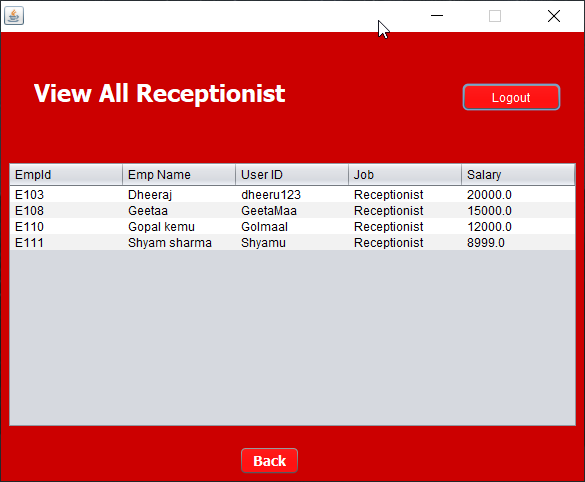

![](data:image/png;base64,iVBORw0KGgoAAAANSUhEUgAAAYEAAACDCAMAAABcOFepAAABEVBMVEX///9AndeXwR50lxhOaA46m9YymNX7/v95uOJPo9mVwBZRp9uszU651G+RweVerd4sltWw0etEYACSvgCwuaDC3fHe7Pf2+fy52/Dt9Nvx9/xukwBmsuDT5vRCoNiGveT1+Ovn9Pvk7smTonO913m61HyWpong7MFxtuH7/fehzerW6fXM36KtzlecyulCXwD0+Oiixz+YslvV5sC71YXW3sHJ1ra7zZ2lu3Kdu02Mqj2rwXvq7+GFo0KAnzVylwDT4LCmu4KbtVng5dOJqjFrgDm3yZNrgD2UrF2pwGvO4ZyZtVB4i1CfxjOnuIqZqHeQoXfDy7J0jD2CkmOqtJWGmldug0xheSjW5rIvUgDQ4qJHtrSKAAANfklEQVR4nO1ci1/bRhKWQlZ+CGwZV34hW5YLhx/YQAKEplxKm7aX445re8lduf7/f8hJu7OrWWkFppia0PmSHz9b+5qdb2dmX7JlEQgEAoFAIBAIBAKBQCAQCAQCgUAgEAgEAoFAIBAIBAKBQCAQCAQCgfBEMOmenr05/+rtV+dfn50erVuaPxMmFxenb77+8Nd3Gxs7Ozsb/O83Gx/OLkrrluz5ozS6fPPt+auNb3aE6jHiB+eXk3VL+Lxx+XZnx6B6TMLOd2cX6xbz+eJ9seo1S3hFJDwS9pdh4Bm6o9IsWrcIEt8vSYFwR6frFnc1KC2Y51X66xYjxtCyLt4uTUFCwuW6RV4JOg6zbcbWbwbvf/h4ZF28W9YCdjbenT+PFUI5JsC2nc665bC+ONz+dWgdbdxqBXym9M3bb388G3XXLfCqEDwZBrZfbv/twjoyOyKh+e/Of7w8HUKByVF3eEt9nw3GT4gBTsHFh52s7jfevfvw98v3F0Mx/5lMhvtXe1vz4+vjq2cwI3pKNhBTEDsi6827HYWNf5y/ORsNIc9ktH9ztXVcbcaoJmhurVHiFeFJ2UBMwT+TrZ+LH89fvYqdfXdi8Z2gybA7OjjZvK5WuepfpGiO1iz2w/G0bODly8N/ia+Tifg73D/Y3drkwx5rXjGwt06ZV4InZgMx5I5D9+Bqa7MK/sagfI7q5++GwAb8guSodc+VQi/3pLTclrJkYPsn/vXoOutwpM4T9684yTDQnwbMYcwN/Xa+hf4icDWUWyi1PUUp40YLJQRuDee0OmN3rK9ho05YcZgzCKZaxhh+WW8zCH2sosa4XuEMMDeoxwgWOLW1cJ0Ebq2fUWIsgkQ99FOOSmHc/5qW2Y/rqC+z5FY2cJh8G70wDfskDlwfz3f39uaQrjHQHyfqj3tjM6c+zcjcCux48Rn/A8QfHRcNr8ARTwWcgVJFkuDYKGcjqYc10ge9RYW3ayflyjNNU07aItTvuFOlr5rHeEFeVjRcV2OnFQ4clRZoNjL1VLW8xobsbC1pz6nhfnONDJYwpJSBs9j/H1dzqo+xuft6vysmoN3NZpaB0IHOcKGdujYcfYYSJZCofU9PissLoX0nkzMa8PSBejCroIZjfUzTVtuuoVXbKUvtOPlET1LrMywy88K02p6jV8u8suCtLYp4qOMLIT8aMHcysP3Jsm6ayOnEqj+enxzsD/UCJ02NgV490x3G0LDpmAiwWUVlaOSUAeOm44gvyjv4nigqh10jw12sYGV+UTYNcgCfvoEBVpOay0js1FMRDMLyxLZoDzNQY/dn4GfLmoMJNKuxz7kaHU1MK68kk2KgPc73ZqAcQmQkADPg53UlNNkSJT3lScU+DgtkwXzVTA3XlpkBmwnJTDYAJjTNC8wCyWwnX46VV8jAx4m1CV7+RC3GDHjdRAwspFDCOYqPrnKPurOVORADVsVhmVSYn7giq3RDpYrWpZ7mx6UW5dRSMpCtWejLKgWOLcuoHHww96UFsDgQq2qlf/MdXEZ89vzHYOCO5VYcLCQDM9XVcVgrD0BoKbJ0Bs6gIsGyDLQXQRCMA44BEOQmCcI/MRd8gC9KytBWhqxOJayFdWgX1Jg2rKqGuKCcWuhWQHAQrczrlfEjjsDT6WIsOfCgUbCBAa9WCjtePQN3rrbmKQMwyFnYiod9qdewGVYbSOw0eoB2P8dAMm1ux/+SP71QJPMZ0Ex0kfVxSwx8fUsaUycJhe0Z+EJJvbABZlu86qTyEJQpnVqv5IJsbS6ZqBaikjNOumOVWmNopoYZiB0hF1YsKFgSJlbNgMkEhvtXJycQFa6akoG20FI6Y/Fh0Pua1tJqWgYGEHp10WNeHJZMC5E00HoknB9LJ6sySoi5CTAwQDWL0Y1mCcAAXhOXpFKlFy2N9RGlhSKYnCVNri4ScwaqhiOAfT4rPRFfThQD/VxPQekhUgvu5B0MSEVyPU2FlhlqyXbAi4Cq0v5F3PqYLabCkbQBc80cBgZa4Flm2SdMVCviAKtDop+EMC8xuxUz0JQMDI/2f9sUH1/zKehcGMGe8kKgJLQSaYH3Rr3WGHBuZyBEeorAJXB9wKAfi2wRH9Gsgld2eJMBbIChmpdhoJ8xgSSXqFY4L+WFAB23UuEL4RUx8GUJbGDIE7pbx8kGhcilMbCrGIBm0FoospGKl2Qg6vf9fp//CZCewCfw2tuB1qFWJcdAGWfIe6HlGHByDNQxsVkGrF4kJFgVA7oNjPimaFPkKmAAhmylngKmLG2kFbRCy3uhfs32PEcCIp8oARaW7BfMwK2AyiFK22mzwcDOM3BfL9TXvUwCEZjABvwsAxIPYuCXHANVcRI/4jPT220glJO37LxbY+CWONCrMcOiDfQEC6fECS903UiHnZvwgzlGv9MLGRgw2ABOF3hMBsAGLsVWRAEDeRUWMqB7oSgwrE5TPbnKDdX1/igGsgAG/igvJPEgBt7n4oD0QpyNFyLXvRkopb3GUugMlFwjAUpP0g2BxuVM5zYGNC+0Oht4TC9kvSyIxJoN3GAGtu5mYIx6XRwHFmYClJ5mYoo5aDW0mVAxA4xps9F72wDLM2CjLjyODVj/lkc0f7GKbeB2BuSGuYQDe3MGG8AMRHJh72TcudRTSTqfIFMRjgM4CjkhLJkf5oXQIxMDK44D1heH2Tgw5M8FAxCJD/CWdJYBMRdy04mJPNq6IxJPIdJWpn4HgNfElgrAsIfjqcmnZMDV2w1UnFjZekCLA4/khS5eZmygim1AYwA2jOYZBuLwV9Kg97owEoNSKuhkM6MnWJSBZaQ9h7jgRpax3WIbcB4UBx7JC1kftzM2UMgA2ICBATPusIH8fZFShgFYiAmg3gADlaIzwJVH4ke1Aev0MLMvhGajy9qAGXcwMNY2PxNkGZCOSthAevwpbSB/PwHSHxSJXWSUYjvd02xg1XHAmvxq3BfaXxkDBZG4lL8vkmNAnj/Yaq9JVLOcDRi8UKrwel5FrUqWJrHXG8/G+LfH8kLWp23dBob8qcbAiZmB/PazBgjU4/SJKQ6g0jkGrHTaiXmGfaGBdj8CYRkvBBaIDuLlmLAr0rZ6sMkCFymKvZAQ00Py3IuBo23TbLTYBjYVA/JEo+DimTyhWcwigI8ZqMljldTqc3pKT0FtdAejDZoJCoxgGRuQM7EaqqMjxjKriGw+HJlJ8gttAKbNzPV7bYHSvRiw/rOtzYVEHBAMHIsc3Abk+UDKQE9Ny+3BwIZ/C6VQeZib3TcCBuSBOWMDCX09YCWLMslAgC8iAXlxhQPecvyfBWlAWSYOzOxUOAcukZXUKSWrj+vqLHkAPfKL4oAciizb02UZOC1mAHshyQA6J1aLYrwsSt1KTfkQDcAAnEDh0naWgVIdsujBJr3tgPusnMAyDFhjJJwD0Ved1NvoAoAqVOiFrMg293RZBqz/bt/hhfY4A1fiS2oD4mZYVr/ppCXKXr7RGIj1WMAQ0hOMdrQc4whNF04U9ct4IWuGZZcJho0STx1AFXqh5Dbdwxj4dIhtYMifaV7oCjOQ2MCuFKp4czlB/1YG4OD1VgbkFnWQuQ1p2NRLVbPMKWVyVyltXqlqmrsXlxpfsQ3EcwjjHtfSDAwLbeBaZOA2UBVeaJTkuZFF8xQwfNnTN+2hpecDfsWUjG9bttFJGUaUvyomD/XlTTHNYQtbYtpV2k4qXEpNRxPJGWCrEcQap369ssmgl2bA+nm7YDYKDIjZKD807l7HJnCdvk85q3v40hVj3gLXHAVe7k4WOiOLxpnSjOFRx7udXOF1c5ey29NMSQcRt/Di79rN9CjZ//PGeh19KbuHyOqFjgM7fo5X05xfOamWZe9pA6bM+92ROFbrodkGXgAD4kZvc3452k0OL5sHuPBsGpZThNkb+VGjFkrIrSA9uawhW0EUp2dvZAt0FrhhTVl+Tf+e3LQuh/lZc2vKW2/o9Xdq47pbD2qdbLOdsLwovA5d8lFP3HvNRmP8sJ3dmdtHu9NduNFb5W/UVOWkCDVu2B4zwXxXwryvh9MLKywuly9TUIuxzVI7ntkbcxeKoolzvxVZgi8OjbPRF83X8cdu+lZBcqX6xc3tdd2Cu26rPB/cm4GjXw8zNnAlxn1zc++6mV5oP9777SHvdN91Y+v54N4MWD8pBsStxYumGvViYdC83ty9OXrgi8TEQDHe/0/ZwHwYTzmPNcfTvN4ddVfwGjd5oVvw5S/AQBxpj+U7rNztz69uVvVDc40/CwOl7NH2MmWs9B2aKmi/ejz/rWt8kWZ5tHspYH3GxncX+wyBehrJOwxFL8sW4UA5/8QI5jfdh/+QTScQh+j8MP/e65TPCL0wqAein/W63OS1i07xijC8bsIrfCc3q/kZm2l+nbjcO56fG9quk++pE95dMIOLvevj+cn+cFW/ndIzvVbqFZ1qfs7oGDZH5enm/XC0Mu0naBl23nLbnM8Cpvt/3hPwtlElp3/09vpzQt4G2NOw9amjHd0lP1vwLAnIxQHmLfWjEn8AGhWM8fQZBmGBqIw76ob95znSCAQCgUAgEAgEAoFAIBAIBAKBQCAQCAQCgUAgEAgEAoFAIBAIBAKBQCAQCAQCgUAgEG7B/wFg6UesPYvCOgAAAABJRU5ErkJggg==)
=============

:department_store:  Megaventory  :package:
=============
About The Application :page_facing_up:
-------------
- In this world of growing technologies everything has been computerized. With large number of work opportunities the Human workforce has increased. Thus there is a need of a system which can handle the data of such a large number of Employees. This project simplifies the task of maintaining records because of its user-friendly nature. The objective of this project is to provide a comprehensive approach towards the management of employee information. This will be done by designing and implementing an ERP management system that will bring up a major paradigm shift in the way that employee information is handled.  

- Megaventory is the combination of technology (hardware and software) and processes and procedures that oversee the monitoring and maintenance of stocked products, whether those products are company assets, raw materials and supplies, or finished products ready to be sent to vendors or end consumers. Additionally, the system will help managers on making right decision for recording process where only the recently used products and popular products will be ordered. The contractors also could make a request on any additional products that they needed. The objective of this system is to make inventory flows smoothly and helps in making decision that will minimize the total cost of inventory which is distinctly different from minimizing inventory.

- It utilizes the feature of Barcode scanning, thus products are easily managed and generation of bill is automated.

### Tech Stack :computer:
-----------
**Frontend:** Java Swing, Java GUI component :sailboat:

**Backend	:** Java, Java Barcode library :fire_engine:

**Database:** Oracle DB  :tractor:

### Objective :sparkles:  :rocket:
-------
- The main aim of the project is to develop Stock Management System Model software in which all the information regarding the stock of the organization will be presented. 

- Nowadays, many companies use the system to avoid overstock, miscount and outages. It is a system for organizing a better inventory data than that was used before which is generally stored in manual form books or in spreadsheets. 

- This application has admin component to manage the inventory and maintenance of the inventory system. The application has general organization profile, stock details, purchase details and the remaining stock that are presented in the organization. 

- This application also provides the remaining balance of the stock as well as the details of the balance of transaction. Each new stock is created and entitled with the named and the entry date of that stock and it can also be updating any time when required as per the transaction or the sales is returned in case.

- The application also keeps the data about the employees and helps in easy management of thier profile.

- This application can be effectively used by the cashier at the counter for generating bills in time saving manner by use of barcode scanning.

### Goal :soccer: 
-----
- To design and develop a user friendly system which handles the information of items or products and calculated it to manage the information system 
- To help staffs in order to find location and the quantity of stocks that have been stored 
- To develop an application that deals with the day-to-day needs of any production organization
- To automate the boring task of billing items by easily scanning the barcode.
- Creation of unique barcode for new products
- Managing staff of an enterprise.
- This system will maintain employee information in a database by fully privacy and authority access. 
- A user friendly front-end for the user to interact with the system

### The Challenge :fire:
-----
- The main problem that occur in several company or retailer is a system to calculate the amount of stocks stored or needed. Based on my survey, I have found that there are company that still using paper based or filing system to save their information or details about their stocks. 
- Heavily manual work will involved in managing and maintaining data which is time-consuming if the administrators or manager want to trace the product status, product information and etc. This also may lead to a situation where the workers forgot to update the inventory to the database or worst may lead to miscount when using manual system

## Screenshots :camera:
--------

